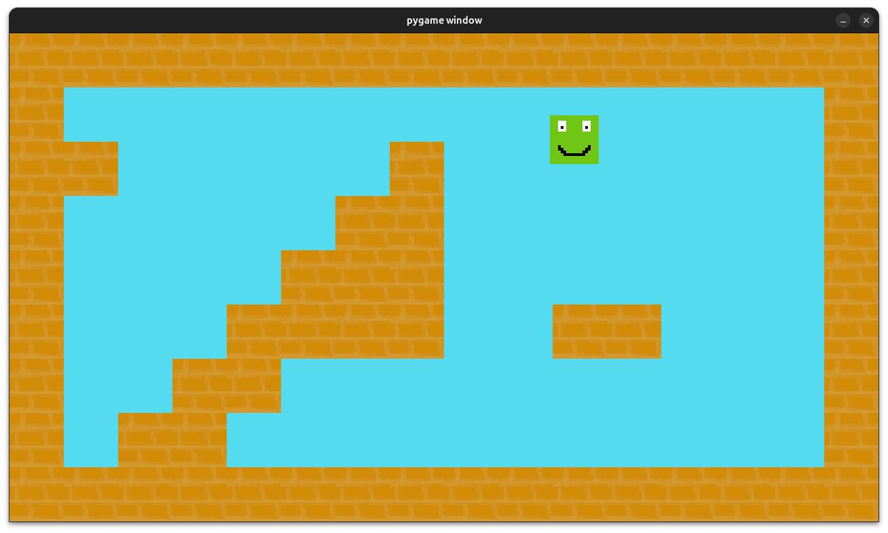

# KAJ JE TO?

To je projek ki je nastal kot naloga za predmet programiranja v srednji šoli.

To je del kode ki je najnujnejši za delovanje platformerja. Iz nje lahko naredimo "scrolig levels", grappling hook, 
letenje in še marsi kaj. Za prikazovanje in prejemanje stanja tipk pa potrebuje python knjižnico pygame, za nalaganje 
konfiguraciske datoteke pa uporabimo knjižnico json. Vsebuje tudi urejevalnik map.

Možno je dodati marsikaj saj koda podpira:
- sile in maso igralca
- pospeške
- enostavni zapis igralne mape
- enostavno spreminjanje gravitacije in podobnih spremenljivk
- preprosta izbira med več različnimi igralnimi mapami

Še par zanimivosti:
- igra je podprta na vseh rezolucijah med 180 x 320 in njenih večkratnikih (možno tudi druge rezolucije a ni priporočeno)
- vsebuje lastni razred Vektor ki hrani 2D vektorje
- igralna mapa je shranjena v txt datoteki kjer je shranjena kot več pravokotnikov ki sestavljajo mapo.